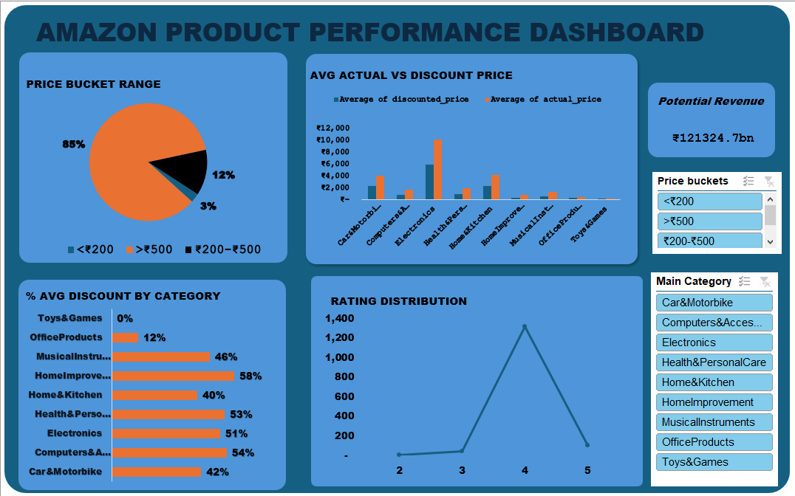

# 📊 Amazon-sales-analysis-Capstone-project
This is a prerequisite for certification after three months of learning data analysis with the incubator hub

## 📌 Project title 
📊 **Amazon sales data analyis**

##  📂 Project Overview

This project focuses on analyzing product data from Amazon's marketplace to uncover patterns in pricing, discounts, ratings, patterns, customer engagement, and category insights. Using Excel's Pivot Tables, Power Query, and custom formulas, I transformed and visualized the data to extract insights that can guide strategic decisions in product improvement, marketing strategies, and customer engagement. 

## 📁 Dataset Description
The dataset contains information scraped from Amazon product pages, including: 
- Product details: name, category, price, discount, and ratings 
 - Customer engagement: user reviews, titles, and content 
 - Each row represents a unique product, with aggregated reviewer data stored as comma-separated values

**Total Records: 	1,465 rows**       
**Total Fields: 16 columns** 

## Data Preparation Cleaning and Transformation
Before analysis, the following transformations were done in Power Query and Excel:
 - Extracting the main category from multi-level category strings
 - Creating a Conditional Column; price bucket and Customn column; Potential Revenue Column
 - Removing duplicate entries and addressing missing vakues through Excel's data validation and filtering tools
 - Standardizing data formats and converting currency values to consistent unit
   
## 🛠 Tools & Techniques Used
- 📌 **Excel Features:**
  - Pivot Tables (with Distinct Count)
  - Power Query Editor (for transformation)
  - Slicers for interactivity
  - Conditional formatting
  
## Exploratory Data Analysis EDA
EDA involved asking several business questions from the data set, such as;

#### 🧠 Key Business Questions Answered
1. What is the average discount percentage by product category? **48%**
2. How many products are listed under each category? **1348**
3. What is the total number of reviews per category? **26,765,385** 
4. Which products have the highest average ratings? **Computer and accessories, home and  kitchen, electronics**
5. What is the average actual vs discounted price by category?
 **Avg actual price 5453**
**Avg Discounted price 3130**
6. Which products have the highest number of reviews?

7. How many products have a discount of 50% or more? 749 
8. What is the distribution of product ratings? 1462
9. What is the potential revenue (actual_price × rating_count) by category? **121,324,729,646.58**  
10. How many unique products fall into each price bucket? 1462
11. How does discount level relate to rating?
   
12. How many products have fewer than 1,000 reviews? **325**
13. Which categories offer the highest discounts? **Computer and accessories 94% electronics 91%, home and kitchen 90%**
14. What are the top 5 products by combined rating and reviews?

 - Amazonbasics flexible premium hdmi cable
 - Amazonbasics high speed hdmi cable support Ethernet black
 - Amazonbasics high speed hdmi cable 2-pack black
 - Boat basshead earwired earphones with mic taffy pink
 - Boat basshead earwired earphones with mic furious red

#### 📌 Key Metrics and Insights
| Metric | Insight |
|--------|---------|
| **Top-performing products** | Had rating above 4.5 and over 10,000 reviews |
| **High discounts** | Mostly found in Electronics |
| **Low-engagement zone** | Products with <1,000 reviews and low ratings |
| **Revenue concentration** | Driven by high-priced items with high review counts |
| **Price Buckets** | ₹200–₹500 products were most common but contributed less to revenue than high-end items but revenue was skewed towards the >₹500 segment, emphasizing that premium products drive more revenue per unit |
| **Discount segments** | Over 25% of the products offered discounts of 50% or more, possibly to stay competitive or to push slow-moving inventory | 

---
 #### 🔵 Visual Dashboard Components
  - Bar charts comparing Actual price vs Discount Price
  -  Pie chart showing product distribution by price bucket rrange
  -  Column chart showing Average discount by category
  -  Line Chart for identifying Products rating distribution
    

 🎛️ **Slicers**:
  - Category
  - Price Bucket

### Dashboard

## ✅ Recommendations

Based on the analysis conducted, here are key recommendations to guide strategic decisions:

1. **Focus on High-Performing Categories**  
   Categories like **Electronics** and **Computers & Accessories** generate the most potential revenue and should receive prioritized marketing and inventory investment.

2. **Optimize Discount Strategies**  
   Products with discounts above **50%** are common in certain categories. Instead of broad discounts, apply **targeted discounting** to underperforming products or to clear inventory while preserving margins.

3. **Encourage More Customer Reviews**  
   Many products have fewer than **1,000 reviews**, which may limit visibility and trust. Implement **post-purchase review prompts** or incentives to increase engagement.

4. **Upsell Premium Products**  
   Products priced above ₹500, although fewer in number, contribute significantly to revenue. Consider upselling and bundling strategies to maximize value per customer.

6. **Refine Product Listing Based on Rating Performance**  
   Low-rated products (<3.0) may damage brand credibility. Either **improve product quality** or **consider delisting** poorly performing items.

7. **Use Price Buckets for Targeted Campaigns**  
   Segment users based on price preferences (e.g., budget: `<₹200`, mid-range: `₹200–₹500`, premium: `>₹500`) and align advertising and product recommendations accordingly.

  
